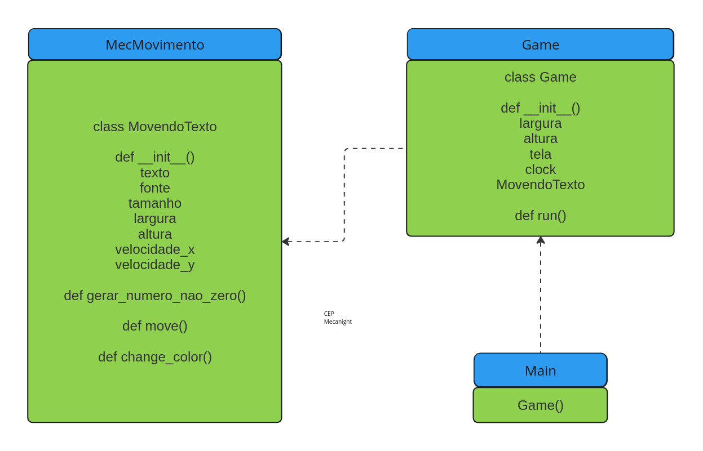

# Bate-bate

## Programa elaborado com a biblioteca Pygame onde um objeto, em movimento, quica nas paredes da tela alterando aleatóriamente a cor e também a direção que irá seguir na sequência do quique.

## Diagrama estrutural do programa

### Apresenta as classes, existentes nos arquivos, com os seus respectivos atributos e métodos